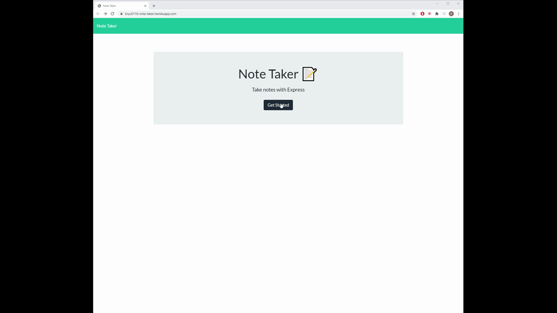

# Note-Taker
## Description
Note Taker is an application that can be used to write, save, and delete notes. This application will use an express backend and save and retrive note data from a JSON file.

## Table of Contents
- [Installation](#installation)
- [Usage](#usage)
- [License](#license)
- [Contributing](#contributing)
- [Questions](#questions)

## Installation
node.js, npm and Express must be installed.

## Usage
AS A user, I want to be able to write and save notes. I WANT to be able to delete notes I've written before. SO THAT I can organize my thoughts and keep track of tasks I need to complete.

In a business context, it's for users that need to keep track of a lot of information, it's easy to forget or be unable to recall something important. Being able to take persistent notes allows users to have written information available when needed.
[View the deployed web application using Heroku.](https://bryu0116-note-taker.herokuapp.com/)

## License
MIT License

Copyright (c) 2020 Brandon Ryu

Permission is hereby granted, free of charge, to any person obtaining a copy
of this software and associated documentation files (the "Software"), to deal
in the Software without restriction, including without limitation the rights
to use, copy, modify, merge, publish, distribute, sublicense, and/or sell
copies of the Software, and to permit persons to whom the Software is
furnished to do so, subject to the following conditions:

The above copyright notice and this permission notice shall be included in all
copies or substantial portions of the Software.

THE SOFTWARE IS PROVIDED "AS IS", WITHOUT WARRANTY OF ANY KIND, EXPRESS OR
IMPLIED, INCLUDING BUT NOT LIMITED TO THE WARRANTIES OF MERCHANTABILITY,
FITNESS FOR A PARTICULAR PURPOSE AND NONINFRINGEMENT. IN NO EVENT SHALL THE
AUTHORS OR COPYRIGHT HOLDERS BE LIABLE FOR ANY CLAIM, DAMAGES OR OTHER
LIABILITY, WHETHER IN AN ACTION OF CONTRACT, TORT OR OTHERWISE, ARISING FROM,
OUT OF OR IN CONNECTION WITH THE SOFTWARE OR THE USE OR OTHER DEALINGS IN THE
SOFTWARE.

## Contributing
[Brandon Ryu](https://github.com/bryu0116/README-Generator)

## Questions
GitHub: https://github.com/bryu0116  
Email: byenguk0116@gmail.com  